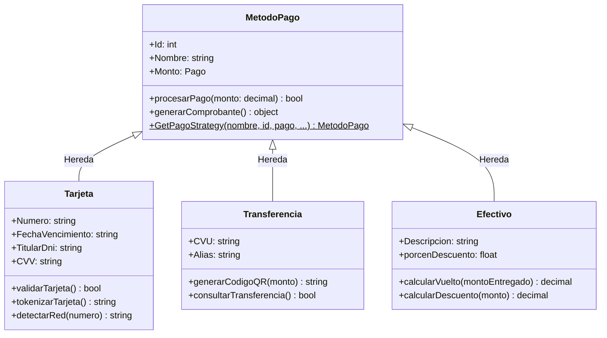

# Implementación del Patrón Estrategia (Strategy Pattern)

Este documento detalla la estructura y el comportamiento final del **Patrón Estrategia** aplicado al procesamiento y visualización de los métodos de pago, tanto en el **Frontend (Next.js / TypeScript)** como en el **Backend (.NET 8 / C#)**.

---

## 1. Diagrama de Clases del Patrón
El patrón se modela a partir de la clase `MetodoPago` que actúa como base y define el comportamiento genérico de pago y la generación de comprobantes. Cada canal de pago específico (`Tarjeta`, `Transferencia`, `Efectivo`) hereda de esta superclase y añade sus atributos y lógica particular.



---

## 2. Implementación en el Frontend (TypeScript)
En el cliente, el patrón se utiliza en dos variantes complementarias: para estructurar las clases del modelo y para renderizar dinámicamente la interfaz gráfica (UI) según el método de pago seleccionado.

### 2.1 Clases del Modelo de Dominio
Archivo: `src/lib/pagos/MetodosPagoClases.ts`
Implementa la estructura del diagrama de clases:
* **`MetodoPago`**: Clase abstracta base.
* **`Tarjeta`**: Añade lógica de validación, tokenización simulada y detección automática de marcas de tarjeta (Visa/Mastercard).
* **`Transferencia`**: Genera la URL dinámica del código QR codificando datos bancarios.
* **`Efectivo`**: Calcula los montos descontados y el vuelto exacto del cliente.

### 2.2 Estrategias de Visualización (UI)
Carpeta: `src/lib/pagos/strategies/`
Define el contrato `PagoStrategy` para renderizar componentes de React:
1. **`EfectivoStrategy`**: Muestra alertas para confirmar cobro manual en mano.
2. **`TarjetaStrategy`**: Renderiza el formulario interactivo para captura estructurada de datos (número, vencimiento, CVV).
3. **`TransferenciaStrategy`**: Muestra la tarjeta del club con el QR generado, CBU y Alias para transferencia directa.

La fábrica `PagoStrategyFactory.ts` devuelve la UI de la estrategia seleccionada a partir del nombre del método de pago.

---

## 3. Implementación en el Backend (C# / .NET 8)
Para mantener una arquitectura limpia y no crear carpetas redundantes, las subclases se implementan directamente en la capa de dominio.

### 3.1 Clases del Patrón
Archivo: `Domain/Entities/MetodoPago.cs`
Todas las subclases y sus métodos se definen dentro del mismo archivo de entidad para facilitar su consulta y presentación:
* **`MetodoPago`** (Clase Base): Define los métodos virtuales `ProcesarPago(decimal monto)` y `GenerarComprobante()`, además de exponer el método de fábrica estático `GetPagoStrategy(...)`.
* **`Tarjeta`**: Valida el número y CVV de la tarjeta (`ValidarTarjeta()`), simula tokenización mediante Base64 (`TokenizarTarjeta()`) y detecta la red de tarjeta (`DetectarRed()`).
* **`Transferencia`**: Genera la estructura del QR con datos bancarios (`GenerarCodigoQR()`) y simula la acreditación (`ConsultarTransferencia()`).
* **`Efectivo`**: Calcula el vuelto (`CalcularVuelto()`) y deduce el descuento aplicable por pago en mano (`CalcularDescuento()`).

### 3.2 Orquestación e Integración
El patrón se ejecuta de forma natural durante la creación y registro de pagos tanto en cobros de cuotas como en membresías nuevas:

* **En Cobro de Cuotas** (`PagoService.cs`):
```csharp
var strategy = MetodoPago.GetPagoStrategy(metodoPago.Nombre, metodoPago.Id, pago);
bool procesado = strategy.ProcesarPago(dto.Monto);
```

* **En Nueva Membresía** (`MembresiaService.cs`):
```csharp
var strategy = MetodoPago.GetPagoStrategy(metodoPago.Nombre, metodoPago.Id, pago);
bool procesado = strategy.ProcesarPago(montoAbonado);
```

Las transacciones y relaciones se escriben en la base de datos de manera estándar utilizando el modelo de EF Core existente, manteniendo la compatibilidad al 100% y sin requerir cambios de esquema de base de datos.

---

## 4. Comparativa de Comportamientos

| Método / Estrategia | Entrada UI (Frontend) | Acción en Transacción (Backend) | Salida / Comprobante |
| :--- | :--- | :--- | :--- |
| **Efectivo** | Mensaje informativo y monto. | Deduce el descuento aplicable (%) e indica cambio/vuelto. | Comprobante con descuento detallado. |
| **Tarjeta** | Formulario estructurado con detección de red (Visa/Master). | Valida número de tarjeta y genera token de seguridad. | Comprobante con token de pasarela. |
| **Transferencia** | Generación de QR dinámico y datos de cuenta. | Simula la llamada de acreditación bancaria (CVU/Alias). | Comprobante listo para conciliación. |
